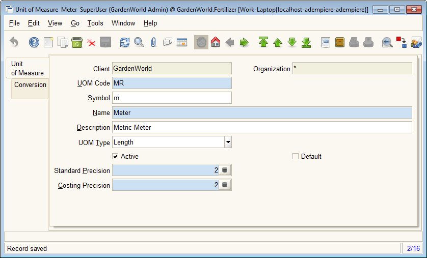
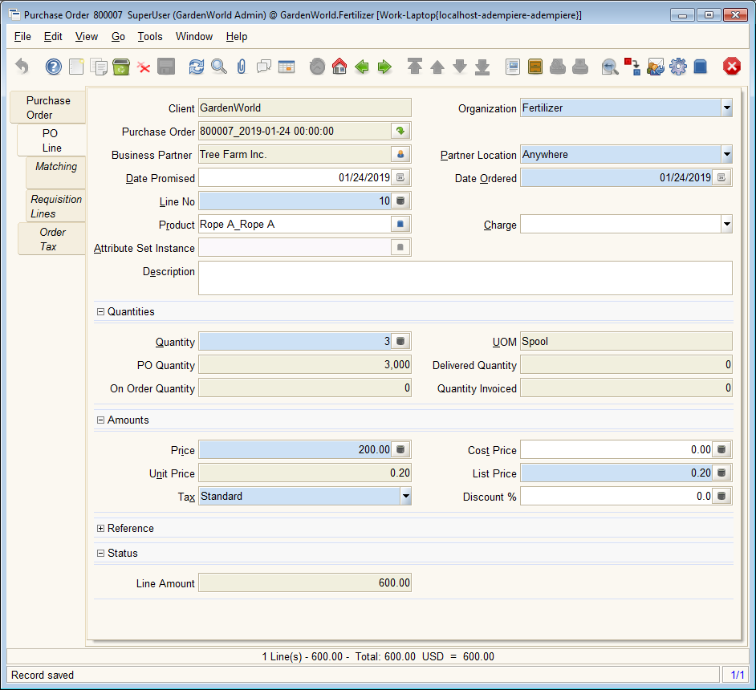
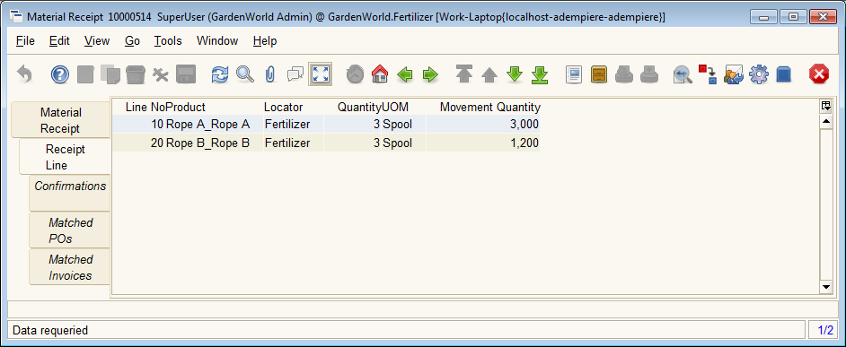

# Units of Measure

Unit of Measure \(UOM\) are how the quantities of products are defined. For Products, these are non monetary in nature and represent something that can be measured such as time, distance, volume, quantity, weight, etc.... Conversion from one UOM to another is possible, allowing the UOM to be specified on documents and have the quantities dealt with properly.

UOM types can include product specific types such as packaging \(box, 6-pack, pallet\). The conversion to other UOM such as "each" can be defined so the packaging can be broken down.

Each UOM is also used to set the precision of quantities and costs. The precision value is the number of decimal places the system will maintain when calculating the quantity or cost of the product.

One UOM should be marked as the default. Typically, this is the unit Each.

## Unit of Measure Conversion

The ADempiere system provides some automatic conversions between common units of measures \(e.g. minute, hour, day, working day, etc.\) but these are only used in resource scheduling operations. All other conversions have to be defined explicitly for each product.

Each product has a base or system UOM. All conversions are from this base UOM. Conversions need to be direct \(i.e. if you have only a conversion between UOMs A-B and B-C, the system cannot convert A-C\).

The conversion is defined by a multiply rate and divide rate used to convert the quantity from one of the units to the other. The Product UOM has to be the smallest UOM in the set of possible conversions. The divide rate must be &gt; =1. For example, to convert Each to Pair, the multiply rate would be 0.5.

As an example, suppose there are two types of rope in inventory. The rope is stocked and sold in meters \(m\) but its is purchased by spool. For rope A, the spool contains 1000m of the rope. For rope B, the spool contains 400m. Each rope product would use Meter as its base unit and each would have a UOM conversion from Meter to Spool with different values.

